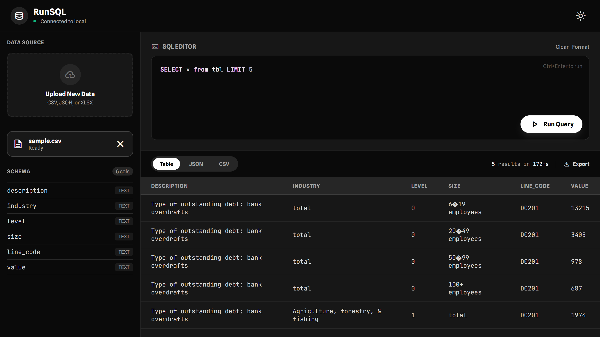

# RunSQL



A hybrid **CLI & Web tool** to run SQL queries on CSV, XLSX, and JSON files, written in Go.

---

## 🎯 Features

- **CLI Mode**: Execute SQL queries from the terminal with Unix philosophy
- **Web Mode**: Spin up a localhost server with a GUI for non-technical users
- **Multi-Format Support**: Parse and query CSV, XLSX, and JSON files
- **In-Memory SQLite**: Load files into SQLite for fast querying
- **Type Inference**: Automatically detect column types (INTEGER, REAL, TEXT)
- **Multiple Output Formats**: Table, JSON, or CSV output
- **Hexagonal Architecture**: Clean separation of concerns (Ports & Adapters)

---

## 📋 Requirements

- **Go 1.21+**
- **SQLite3** (with CGO enabled for `go-sqlite3`)
- **Windows/Linux/macOS** (cross-platform support)

---

## 🚀 Installation

### From Source

```bash
# Clone or download the repository
git clone https://github.com/zulfikawr/runsql
cd runsql

# Install dependencies
go mod download

# Build the executable
go build -o runsql ./cmd/runsql
# or
go build -o runsql.exe ./cmd/runsql # for Windows
```

### Pre-built Binary

Download the compiled executable from the [Releases](releases) page.

---

## 📖 Usage

### CLI Mode (Default)

Execute SQL queries directly from the terminal.

#### Basic Syntax

```bash
./runsql -f <file> -q <query> -o <format>
```

#### Parameters

| Flag | Description                           | Default  | Example                             |
| ---- | ------------------------------------- | -------- | ----------------------------------- |
| `-f` | File path (CSV, XLSX, or JSON)        | Required | `-f data/sales.csv`                 |
| `-q` | SQL query                             | Required | `-q "SELECT * FROM sales LIMIT 10"` |
| `-o` | Output format: `table`, `json`, `csv` | `table`  | `-o json`                           |

#### Examples

**Example 1: Query CSV with table output**

```bash
./runsql -f sample/sample.csv -q "SELECT industry, COUNT(*) as count FROM sample WHERE level = 0 GROUP BY industry" -o table
```

Output:

```
| industry | count |
+----------+-------+
| total    | 705     |
```

**Example 2: Query JSON with JSON output**

```bash
./runsql -f sample/sample.json -q "SELECT language, COUNT(*) as users FROM sample GROUP BY language ORDER BY users DESC" -o json
```

Output:

```json
[
  {
    "language": "Sindhi",
    "users": 1000
  }
]
```

**Example 3: Query with CSV output**

```bash
./runsql -f data.csv -q "SELECT name, email FROM data WHERE age > 30" -o csv
```

Output:

```csv
name,email
John Doe,john@example.com
Jane Smith,jane@example.com
```

**Example 4: JOIN Query (Multi-File)**

```bash
./runsql -f users.csv,orders.json -q "SELECT users.name, orders.item FROM users JOIN orders ON users.id = orders.user_id"
```

### Web Mode

Launch an interactive web interface for querying files.

#### Syntax

```bash
./runsql -web -addr ":8080"
```

#### Parameters

| Flag    | Description                | Default          |
| ------- | -------------------------- | ---------------- |
| `-web`  | Enable web mode            | false (CLI mode) |
| `-addr` | Server address (host:port) | `:8080`          |

#### Example

```bash
./runsql -web -addr ":3000"
```

Then open your browser to `http://localhost:3000` and:

1. Upload a CSV, XLSX, or JSON file
2. Enter an SQL query
3. View results in the browser

---

## 📂 Project Structure

```
runsql/
├── cmd/
│   └── runsql/              # Entry point
│       └── main.go          # CLI/Web mode dispatcher
├── internal/
│   ├── adapter/             # Interface adapters (Ports & Adapters pattern)
│   │   ├── cli/             # CLI-specific logic
│   │   │   └── cli.go
│   │   └── web/             # HTTP handlers & server
│   │       └── web.go
│   ├── core/                # Business logic (The Brain)
│   │   ├── domain.go        # Struct definitions
│   │   ├── engine.go        # SQLite lifecycle & query execution
│   │   ├── engine_test.go   # Unit tests
│   │   └── infer.go         # Type inference logic
│   ├── parsers/             # File readers (Ports)
│   │   ├── parser.go        # Interface definition
│   │   ├── csv.go           # CSV parser
│   │   ├── json.go          # JSON parser
│   │   ├── xlsx.go          # Excel parser
│   │   └── parsers_test.go  # Unit tests
│   └── ui/                  # UI logic
│       ├── colors.go        # Colors definition
├── web/                     # Static frontend assets
│   ├── index.html           # Web UI
│   ├── script.js            # JavaScript
│   └── style.css            # Styling
├── go.mod                   # Go module definition
├── go.sum                   # Go module lock file
├── LICENSE                  # MIT License
├── .gitignore              # Git ignore rules
└── README.md               # This file
```

---

## 🏗️ Architecture

RunSQL follows the **Hexagonal Architecture (Ports & Adapters)** pattern:

```
┌────────────────────────────────────┐
│         User Interfaces            │
│  (CLI Adapter)  │   (Web Adapter)  │
└────────┬────────┴────────┬─────────┘
         │                 │
    ┌────▼────────────────▼────┐
    │    Ports (Interfaces)    │
    │ - Source (Parser)        │
    │ - Engine (SQLite)        │
    └────┬─────────────────┬───┘
         │                 │
    ┌────▼──────────────────▼────┐
    │   Core Business Logic      │
    │ - Type Inference           │
    │ - Database Engine          │
    │ - Query Execution          │
    └────┬─────────────────┬─────┘
         │                 │
    ┌────▼─────────────────▼────┐
    │ Adapters (Implementations)│
    │ - CSV, JSON, XLSX Parsers │
    │ - SQLite Engine           │
    └───────────────────────────┘
```

### Key Design Principles

- **Separation of Concerns**: Core logic is independent of UI and data sources
- **Testability**: Each layer can be tested independently
- **Extensibility**: Add new file formats or UI modes without changing core logic
- **Clean Dependencies**: Always point toward the core business logic

---

## 🧪 Testing

### Run All Tests

```bash
go test ./...
```

### Run Tests for Specific Package

```bash
go test ./internal/parsers
go test ./internal/core
```

### Run with Coverage

```bash
go test -cover ./...
```

---

## 📊 Supported File Formats

### CSV

- Standard RFC 4180 format
- Automatic header detection
- Custom delimiters supported

### JSON

- Array of objects: `[{"col1": value1, "col2": value2}, ...]`
- Flat structures only (no nested objects)
- Type inference from values

### XLSX

- Reads first sheet by default
- Treats first row as headers
- All other sheets can be ignored

---

### Issue: "Column not found" error

**Problem**: Query references a column that doesn't exist in the file.

**Solution**:

1. Check header row in your file
2. Use column names exactly as they appear (case-sensitive in some databases)
3. Run a `SELECT *` query first to see all available columns

### Issue: Type mismatch errors

**Problem**: Query expects INTEGER but column contains TEXT.

**Solution**:

- RunSQL infers types from the first 100 rows
- If your file has mixed types, try casting: `CAST(column AS TEXT)`

### Issue: Large file crashes or is slow

**Problem**: File is too large or has memory issues.

**Solution**:

- Files should be < 500MB for optimal performance
- For larger files, consider splitting into multiple files
- Use WHERE clauses to filter data early

### Issue: Web server won't start

**Problem**: Port is already in use or permissions issue.

**Solution**:

```bash
# Try a different port
./runsql -web -addr ":3000"

# On Linux/Mac, use sudo for ports < 1024
sudo ./runsql -web -addr ":80"
```

### Issue: CGO error on Windows

**Problem**: "missing gcc" or CGO compilation errors.

**Solution**:

- Install MinGW or TDM-GCC for CGO support
- Or use WSL (Windows Subsystem for Linux)
- Or download pre-built binary from releases

---

## 📄 License

This project is licensed under the **MIT License** - see [LICENSE](LICENSE) file for details.

---

## 🤝 Contributing

Contributions are welcome! Please feel free to submit a Pull Request.

### Ways to Contribute

1. **Bug Reports**: Open an issue with reproduction steps
2. **Feature Requests**: Suggest new features or improvements
3. **Code**: Submit PRs with improvements or fixes
4. **Documentation**: Help improve this README or add examples

---

## 🎓 Learn More

### About Hexagonal Architecture

- [Hexagonal Architecture Introduction](<https://en.wikipedia.org/wiki/Hexagonal_architecture_(software)>)
- [Alistair Cockburn's Original Article](https://alistair.cockburn.us/hexagonal-architecture/)

### Go Resources

- [Go Documentation](https://golang.org/doc)
- [SQLite3 Go Driver](https://github.com/mattn/go-sqlite3)

### SQL References

- [SQLite SQL Dialect](https://www.sqlite.org/lang.html)
- [Common SQL Queries](https://www.w3schools.com/sql/)

---

**Happy Querying!** 🚀
